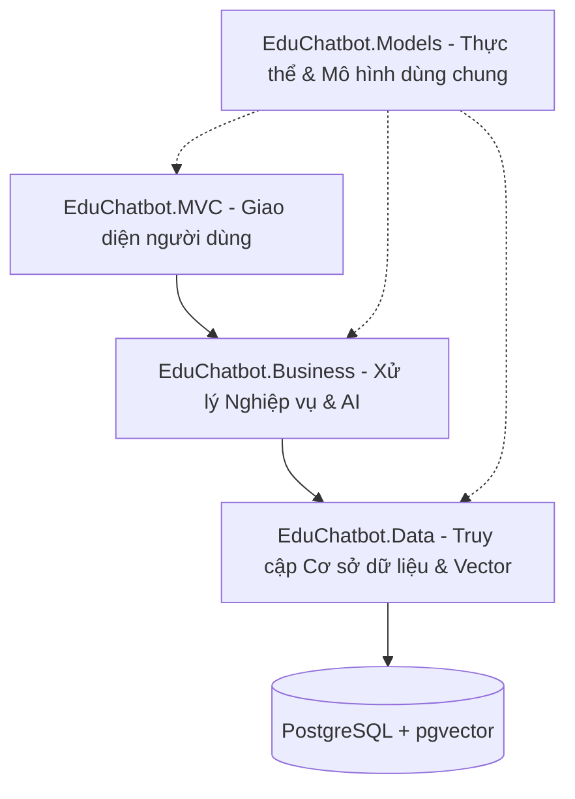

# EduChatbot - Hệ Thống Chatbot Hỗ Trợ Học Tập Thông Minh

EduChatbot là một ứng dụng web hỗ trợ giảng dạy và học tập tích hợp Trí tuệ nhân tạo (AI) giúp phân tích, quản lý tài liệu học tập và phản hồi câu hỏi của sinh viên dựa trên cơ sở tri thức chính xác của từng môn học. Dự án được phát triển bằng **.NET 9** theo cấu trúc **Kiến trúc 3 lớp (3-Layer Architecture)** chặt chẽ và cơ sở dữ liệu **PostgreSQL + pgvector** trên Docker.

---

## 🛠️ Tính Năng Nổi Bật

### 1. Quản Lý Môn Học & Phân Công Giảng Dạy
* **Tạo và Quản lý Môn học**: Admin có toàn quyền tạo mới môn học (Mã môn, Tên môn) và phân quyền quản lý.
* **Phân công Giảng viên**: Giảng viên được phân công phụ trách giảng dạy cụ thể từng môn học.
* **Bảo mật Đăng tải**: Giảng viên chỉ được phép tải tài liệu lên hệ thống đối với những môn học mà họ đã được phân công dạy (Admin có quyền upload cho mọi môn).

### 2. Kiểm Định Tài Liệu Học Tập Bằng AI (AI Document Validation)
* **Quy trình phân tích tự động**: Khi giảng viên tải tài liệu mới lên (PDF/DOCX), AI sẽ tự động kích hoạt chế độ kiểm định (`Analyzing`).
* **Phát hiện Lạc đề & Sai sót**: AI đối chiếu tài liệu mới với chủ đề môn học và toàn bộ tài liệu cũ đã hợp lệ để tìm mâu thuẫn (Ví dụ: thông tin ngày thi, hình thức kiểm tra bị lệch).
* **Quản lý Vector**: Chỉ những tài liệu hợp lệ (`Valid`) mới được chia nhỏ (Chunking), tạo Embeddings và lưu vào cơ sở dữ liệu Vector để làm ngữ cảnh trả lời câu hỏi.

### 3. Nhập Tài Khoản Sinh Viên Hàng Loạt Qua Excel & Tùy Chọn Email
* **Import Excel hiệu năng cao**: Nhập hàng loạt tài khoản sinh viên bằng file Excel `.xlsx` sử dụng thư viện **MiniExcel**.
* **Sinh mật khẩu ngẫu nhiên**: Tự động tạo mật khẩu bảo mật ngẫu nhiên cho từng sinh viên.
* **Tùy chọn Email**: Cung cấp checkbox **"Gửi email thông báo"** trên cả form import Excel lẫn form tạo thủ công. Khi bật, hệ thống sẽ gửi thông tin đăng nhập tự động qua email (sử dụng file logging ở local khi phát triển).

### 4. Chat Thông Minh Lọc Theo Môn Học (Course-Scoped Chat)
* **Định hướng Ngữ cảnh**: Sinh viên chọn môn học cụ thể khi bắt đầu cuộc trò chuyện.
* **Truy vấn Chính xác**: AI chỉ truy vấn dữ liệu từ những tài liệu hợp lệ thuộc **đúng môn học được chọn**, tránh làm nhiễu hoặc sai lệch thông tin giữa các môn học khác nhau.

### 5. Giao Diện Tối Cao Cấp (Premium Dark Theme UI)
* Thiết kế hiện đại dựa trên màu sắc hòa hợp và độ tương phản cao, tối ưu hiển thị trên các màn hình tối.
* Các ô nhập liệu, danh sách lựa chọn, tiêu đề bảng hiển thị rõ ràng và đẹp mắt, không bị hiện tượng chữ chìm mờ.

---

## 📐 Kiến Trúc Dự Án (3-Layer Architecture)

Dự án tuân thủ nghiêm ngặt mô hình kiến trúc 3 lớp nhằm tách biệt trách nhiệm:



* **`EduChatbot.MVC`**: Tầng giao diện người dùng hiển thị Controller, Action và Razor Views.
* **`EduChatbot.Business`**: Tầng dịch vụ (`Services`) chứa logic nghiệp vụ, import Excel, tích hợp dịch vụ Email và các API AI OpenRouter/Embeddings.
* **`EduChatbot.Data`**: Tầng truy cập dữ liệu quản lý `ApplicationDbContext`, cấu hình Entity Framework, Repositories và lưu trữ vector.
* **`EduChatbot.Models`**: Tầng chứa các thực thể Entity DB, ViewModels và DTOs dùng chung cho cả 3 tầng.

---

## 🚀 Hướng Dẫn Cài Đặt & Chạy Dự Án

### Yêu Cầu Hệ Thống
* .NET 9 SDK
* Docker Desktop
* Key API OpenRouter (đã cấu hình sẵn trong appsettings.json)

### Bước 1: Khởi động Cơ sở dữ liệu Postgres + pgvector
Chạy lệnh sau tại thư mục gốc chứa file `docker-compose.yml` để khởi chạy container DB:
```bash
docker-compose up -d
```
*Lưu ý: PostgreSQL sẽ chạy trên cổng máy chủ **5433**.*

### Bước 2: Cập nhật Migration và Tạo cơ sở dữ liệu
Áp dụng các migration Entity Framework Core để khởi tạo bảng dữ liệu:
```bash
dotnet ef database update --project EduChatbot.Data --startup-project EduChatbot.MVC
```

### Bước 3: Khởi chạy Ứng dụng Web
Khởi động dự án Web MVC:
```bash
dotnet run --project EduChatbot.MVC
```
*Giao diện Web sẽ hoạt động tại địa chỉ: **http://localhost:5287***

---

## 🔐 Tài Khoản Đăng Nhập Mặc Định

Hệ thống đã tự động cài cắm dữ liệu mẫu (Seeded Accounts):

1. **Quản Trị Viên (Admin)**:
   - Email: `admin@educhatbot.local`
   - Mật khẩu: `Admin@123456`
2. **Sinh Viên (Student)**:
   - Email: `truongchitrung05@gmail.com`
   - Mật khẩu: `Admin@123456`

---

## 📁 Nhật Ký Email Cục Bộ (Local Email Logs)
Khi hệ thống gửi email đăng ký cho sinh viên/giảng viên, do chạy ở môi trường phát triển cục bộ, email sẽ được lưu trữ dưới dạng các file văn bản `.txt` tại thư mục sau để bạn tiện kiểm tra:
`C:\Users\truon\.gemini\antigravity\brain\068de350-8b17-4025-bbcb-fb2d649f000f\emails\`
