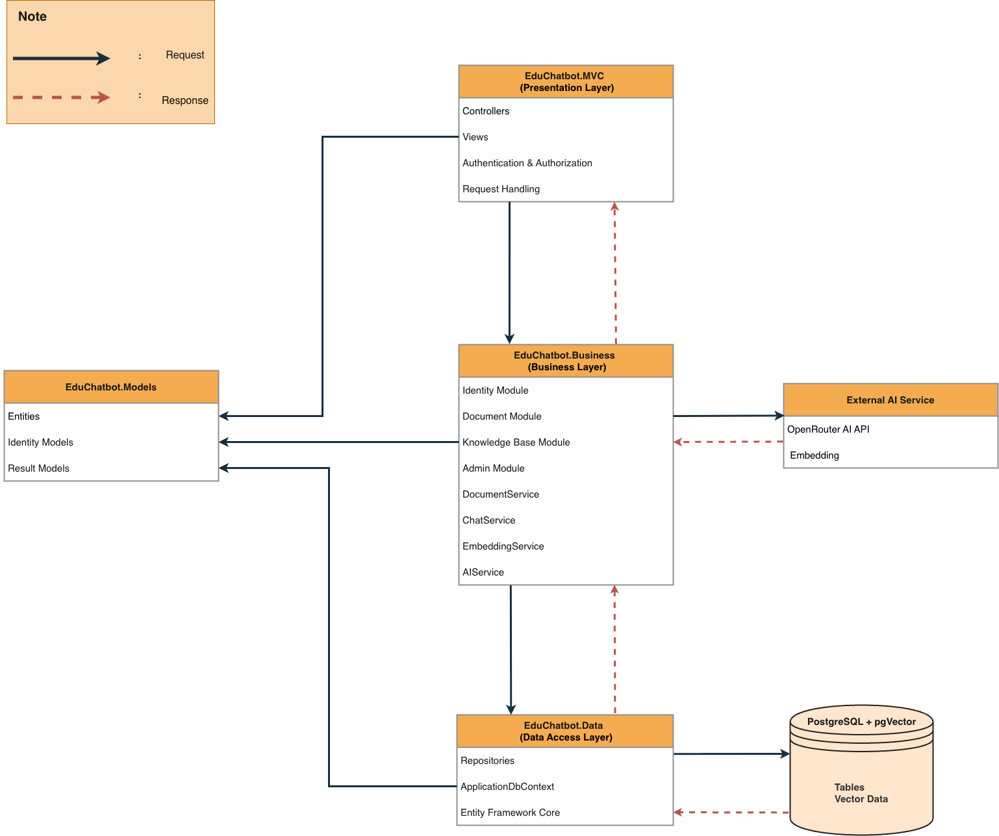

# EduChatbot - Hệ thống Chatbot học thuật

EduChatbot là ứng dụng web ASP.NET Core MVC hỗ trợ quản lý tài liệu học tập và chatbot theo từng môn học. Hệ thống cho phép Admin quản lý tài khoản, môn học và phân công giảng viên; Lecturer upload tài liệu cho môn được phân công; Student đặt câu hỏi dựa trên các tài liệu đã được duyệt.

Dự án sử dụng .NET 9, ASP.NET Core MVC, Entity Framework Core, PostgreSQL, pgvector, OpenRouter AI API và kiến trúc 3 lớp.

## Tính năng chính

- Quản lý tài khoản Student và Lecturer.
- Quản lý môn học và phân công Lecturer phụ trách môn học.
- Lecturer chỉ được upload tài liệu cho môn học đã được Admin phân công.
- Extract text từ file PDF/DOCX.
- Tính độ phù hợp giữa tài liệu và môn học bằng Embedding + Cosine Similarity.
- Admin review tài liệu có Match Score thấp.
- Chunk tài liệu và lưu vector embedding vào PostgreSQL + pgvector.
- Chatbot trả lời theo phạm vi môn học được chọn.
- Student và Lecturer có thể chỉnh sửa profile, đổi mật khẩu.
- Email queue để gửi email thông báo tài khoản.
- Import tài khoản Student/Lecturer bằng Excel.
- Hỗ trợ localization đơn giản cho giao diện.

## Kiến trúc dự án

Dự án đi theo kiến trúc 3 lớp:



```text
EduChatbot.MVC
Presentation Layer
- Controllers
- Views
- ViewModels
- Authentication / Authorization
- Nhận request và trả response

        |
        v

EduChatbot.Business
Business Layer
- AdminService
- DocumentService
- ChatService
- OpenRouterEmbeddingService
- EmailQueueService
- Business rules
- Xử lý PDF/DOCX
- Tính Match Score
- Tích hợp AI / Embedding API

        |
        v

EduChatbot.Data
Data Access Layer
- ApplicationDbContext
- Repositories
- Entity Framework Core
- Migrations
- Truy cập PostgreSQL / pgvector

        |
        v

PostgreSQL + pgvector
```

Các model dùng chung nằm trong:

```text
EduChatbot.Models
```

Thư mục này chứa:

- Entities
- Identity models
- Status constants
- Result models

## Cấu trúc thư mục

```text
EduChatbotSolution/
├── EduChatbot.MVC/          # Dự án ASP.NET Core MVC
├── EduChatbot.Business/     # Service và business logic
├── EduChatbot.Data/         # DbContext, Repository, Migration
├── EduChatbot.Models/       # Entity và model dùng chung
├── SampleExcels/            # File mẫu import Excel
├── docker-compose.yml       # PostgreSQL + pgvector
├── .env.example             # File mẫu biến môi trường
├── global.json              # Phiên bản .NET SDK
└── README.md
```

## Yêu cầu môi trường

Cần cài đặt trước:

- .NET 9 SDK
- Docker Desktop hoặc Docker Engine
- Git
- PostgreSQL client hoặc pgAdmin, không bắt buộc nhưng hữu ích
- OpenRouter API key để chạy AI/chat/embedding

Kiểm tra .NET:

```bash
dotnet --version
```

Dự án có file `global.json` để ưu tiên .NET 9 SDK:

```json
{
  "sdk": {
    "version": "9.0.305",
    "rollForward": "latestFeature"
  }
}
```

Nếu máy bạn có .NET 9 SDK mới hơn, `rollForward` cho phép dùng phiên bản tương thích mới hơn.

## Clone hoặc tải dự án

Clone từ GitHub:

```bash
git clone <repository-url>
cd EduChatbotSolution
```

Nếu tải file ZIP, hãy giải nén và mở terminal tại thư mục `EduChatbotSolution`.

## Cấu hình môi trường

Dự án cần cấu hình:

- PostgreSQL password
- Database connection string
- OpenRouter API key
- SMTP settings, nếu muốn gửi email thật

Không commit API key hoặc password thật lên Git.

### 1. Tạo file `.env`

Copy từ file mẫu:

```bash
cp .env.example .env
```

Mở `.env` và thay giá trị:

```env
POSTGRES_PASSWORD=123456
```

Mặc định `appsettings.json` đang dùng connection string:

```text
Host=localhost;Port=5433;Database=educhatbotdb;Username=postgres;Password=123456
```

Nếu bạn đổi `POSTGRES_PASSWORD`, cần cập nhật connection string bằng user-secrets ở bước dưới.

### 2. Cấu hình user-secrets

Khởi tạo user-secrets cho project MVC nếu máy chưa có:

```bash
dotnet user-secrets init --project EduChatbot.MVC
```

Thêm OpenRouter API key:

```bash
dotnet user-secrets set "OpenRouter:ApiKey" "YOUR_OPENROUTER_API_KEY" --project EduChatbot.MVC
```

Nếu password PostgreSQL không phải `123456`, override connection string:

```bash
dotnet user-secrets set "ConnectionStrings:DefaultConnection" "Host=localhost;Port=5433;Database=educhatbotdb;Username=postgres;Password=YOUR_POSTGRES_PASSWORD" --project EduChatbot.MVC
```

Cấu hình SMTP nếu muốn gửi email thật:

```bash
dotnet user-secrets set "Smtp:Host" "smtp.gmail.com" --project EduChatbot.MVC
dotnet user-secrets set "Smtp:Port" "587" --project EduChatbot.MVC
dotnet user-secrets set "Smtp:EnableSsl" "true" --project EduChatbot.MVC
dotnet user-secrets set "Smtp:Username" "YOUR_EMAIL" --project EduChatbot.MVC
dotnet user-secrets set "Smtp:Password" "YOUR_APP_PASSWORD" --project EduChatbot.MVC
dotnet user-secrets set "Smtp:SenderEmail" "YOUR_EMAIL" --project EduChatbot.MVC
dotnet user-secrets set "Smtp:SenderName" "EduChatbot System" --project EduChatbot.MVC
```

Xem lại user-secrets đã cấu hình:

```bash
dotnet user-secrets list --project EduChatbot.MVC
```

## Chạy PostgreSQL + pgvector

Chạy tại thư mục gốc của solution, nơi có file `docker-compose.yml`:

```bash
docker-compose up -d
```

Thông tin database:

```text
Container: educhatbot-postgres
Host port: 5433
Container port: 5432
Database: educhatbotdb
Username: postgres
Password: lấy từ file .env
```

Kiểm tra container:

```bash
docker-compose ps
```

Tắt database:

```bash
docker-compose down
```

Tắt database và xóa volume dữ liệu:

```bash
docker-compose down -v
```

Chỉ dùng `down -v` khi bạn muốn xóa toàn bộ dữ liệu local trong database.

## Apply database migration

Nếu chưa có `dotnet ef`, cài bằng lệnh:

```bash
dotnet tool install --global dotnet-ef
```

Apply migration:

```bash
dotnet ef database update --project EduChatbot.Data --startup-project EduChatbot.MVC
```

Lệnh này tạo các bảng cần thiết:

- Bảng ASP.NET Identity
- Documents
- Document chunks
- Courses
- Lecturer-course assignments
- Chat histories/conversations
- Email queue
- Các cột embedding dùng pgvector

## Build dự án

```bash
dotnet build EduChatbot.MVC/EduChatbot.MVC.csproj
```

Kết quả mong đợi:

```text
Build succeeded.
0 Warning(s)
0 Error(s)
```

## Chạy ứng dụng web

```bash
dotnet run --project EduChatbot.MVC/EduChatbot.MVC.csproj --launch-profile http
```

Mở trình duyệt:

```text
http://localhost:5287
```

Nếu port `5287` đang bị chiếm:

```bash
lsof -nP -iTCP:5287 -sTCP:LISTEN
kill <PID>
```

Sau đó chạy lại project.

## Tài khoản mặc định

Hệ thống tự seed một tài khoản Admin khi khởi động:

```text
Email: admin@educhatbot.local
Password: Admin@123456
Role: Admin
```

Sau khi login bằng Admin, bạn có thể tạo tài khoản Student và Lecturer trong Admin Dashboard.

## Luồng demo cơ bản

### Admin

1. Login bằng tài khoản Admin mặc định.
2. Tạo môn học.
3. Tạo tài khoản Lecturer.
4. Phân công môn học cho Lecturer.
5. Review tài liệu Pending Review.
6. Quản lý tài khoản Student.

### Lecturer

1. Login bằng tài khoản Lecturer do Admin tạo.
2. Mở trang upload document.
3. Chọn môn học được phân công.
4. Upload file PDF/DOCX.
5. Hệ thống kiểm tra:
   - Lecturer có được phân công môn đó không.
   - Nội dung tài liệu có phù hợp với môn học không.
6. Nếu Match Score đủ cao, tài liệu được Approved và index vào vector database.
7. Nếu Match Score thấp, tài liệu chuyển sang Pending Review để Admin duyệt.

### Student

1. Login bằng tài khoản Student do Admin tạo.
2. Chọn môn học.
3. Đặt câu hỏi.
4. Chatbot tìm các document chunks đã được duyệt trong môn học đó.
5. Hệ thống gửi context sang OpenRouter AI API và trả lời cho Student.

## Logic kiểm tra tài liệu upload

Hệ thống dùng 2 lớp kiểm tra.

### 1. Kiểm tra phân công môn học

Đây là business rule bắt buộc:

```text
Lecturer chỉ được upload tài liệu cho môn học được Admin phân công.
```

Hệ thống kiểm tra:

```text
LecturerId + CourseId
```

trong bảng:

```text
lecturer_courses
```

Nếu Lecturer không được phân công môn học đã chọn, hệ thống từ chối upload.

### 2. Tính Match Score giữa tài liệu và môn học

Sau khi Lecturer pass kiểm tra phân công môn học, hệ thống mới kiểm tra nội dung tài liệu.

Hệ thống dùng:

```text
Embedding Model + Cosine Similarity
```

Hệ thống không dùng GPT/chat completion để quyết định tài liệu có đúng môn học hay không.

Luồng xử lý:

```text
Course Code + Course Name + Course Description
        ↓
Generate subject embedding

Extracted document text
        ↓
Generate document embedding

Compare vectors bằng Cosine Similarity
        ↓
Match Score = Similarity * 100
```

Nếu:

```text
Match Score >= 50
```

tài liệu được Approved và index vào vector database.

Nếu:

```text
Match Score < 50
```

tài liệu chuyển sang Pending Review để Admin duyệt.

## Cấu hình AI và Embedding

Dự án dùng OpenRouter cho:

- Chat completion
- Embedding generation

Cấu hình chính nằm trong:

```text
EduChatbot.MVC/appsettings.json
```

Các section quan trọng:

```json
"OpenRouter": {
  "ApiKey": "",
  "Model": "nvidia/nemotron-3-super-120b-a12b:free",
  "BaseUrl": "https://openrouter.ai/api/v1/chat/completions"
},
"Embedding": {
  "Model": "openai/text-embedding-3-small",
  "BaseUrl": "https://openrouter.ai/api/v1/embeddings",
  "Dimensions": 1536
}
```

Không điền API key thật vào `appsettings.json`. Hãy dùng user-secrets:

```bash
dotnet user-secrets set "OpenRouter:ApiKey" "YOUR_OPENROUTER_API_KEY" --project EduChatbot.MVC
```

## File mẫu import Excel

File mẫu nằm trong:

```text
SampleExcels/
```

Bao gồm:

```text
SampleExcels/StudentImportTemplate.csv
SampleExcels/LecturerImportTemplate.csv
```

Giao diện upload đang nhận file `.xlsx`. Bạn có thể mở file `.csv` bằng Excel hoặc Google Sheets rồi export thành `.xlsx`.

Với Lecturer import, cột `CourseCodes` hỗ trợ nhiều mã môn học trong một ô, phân tách bằng dấu `;`:

```text
PRN222;SWP391;PRM392
```

## Các lệnh thường dùng

Kiểm tra nhánh hiện tại:

```bash
git branch --show-current
```

Kiểm tra trạng thái Git:

```bash
git status
```

Build:

```bash
dotnet build EduChatbot.MVC/EduChatbot.MVC.csproj
```

Run:

```bash
dotnet run --project EduChatbot.MVC/EduChatbot.MVC.csproj --launch-profile http
```

Apply migrations:

```bash
dotnet ef database update --project EduChatbot.Data --startup-project EduChatbot.MVC
```

Xem user-secrets:

```bash
dotnet user-secrets list --project EduChatbot.MVC
```

Start database:

```bash
docker-compose up -d
```

Stop database:

```bash
docker-compose down
```

## Xử lý lỗi thường gặp

### Port 5287 đang bị chiếm

```bash
lsof -nP -iTCP:5287 -sTCP:LISTEN
kill <PID>
```

### Docker database không chạy

Kiểm tra Docker đã bật chưa, sau đó chạy:

```bash
docker-compose ps
docker-compose logs educhatbot-postgres
```

### Không kết nối được database

Kiểm tra:

- Container database đang chạy.
- Port đang dùng là `5433`.
- Password trong `.env` khớp với connection string.
- Nếu đã đổi password, user-secret connection string đã đúng chưa.

### Không có lệnh `dotnet ef`

```bash
dotnet tool install --global dotnet-ef
```

Sau đó mở lại terminal nếu cần.

### OpenRouter báo lỗi maximum context length

Lỗi này nghĩa là text gửi lên embedding model quá dài.

Cách xử lý khi test:

- Dùng file PDF/DOCX ngắn hơn.
- Giảm số lượng text dùng để tạo embedding.
- Giảm kích thước chunk trong logic xử lý document nếu cần.

### No space left on device

Máy bị hết dung lượng ổ đĩa.

Dọn output build:

```bash
dotnet clean EduChatbot.MVC/EduChatbot.MVC.csproj
rm -rf */bin */obj
```

Dọn Docker cache nếu cần:

```bash
docker system prune
```

## Lưu ý trước khi push code

Trước khi push, kiểm tra không có secret bị commit:

```bash
git status
git diff --cached
```

Không commit:

- OpenRouter API key thật
- SMTP app password thật
- File `.env`
- Database dump local

Quy trình khuyến nghị:

```bash
git status
dotnet build EduChatbot.MVC/EduChatbot.MVC.csproj
git add .
git commit -m "docs: update project setup guide"
git push origin main
```
